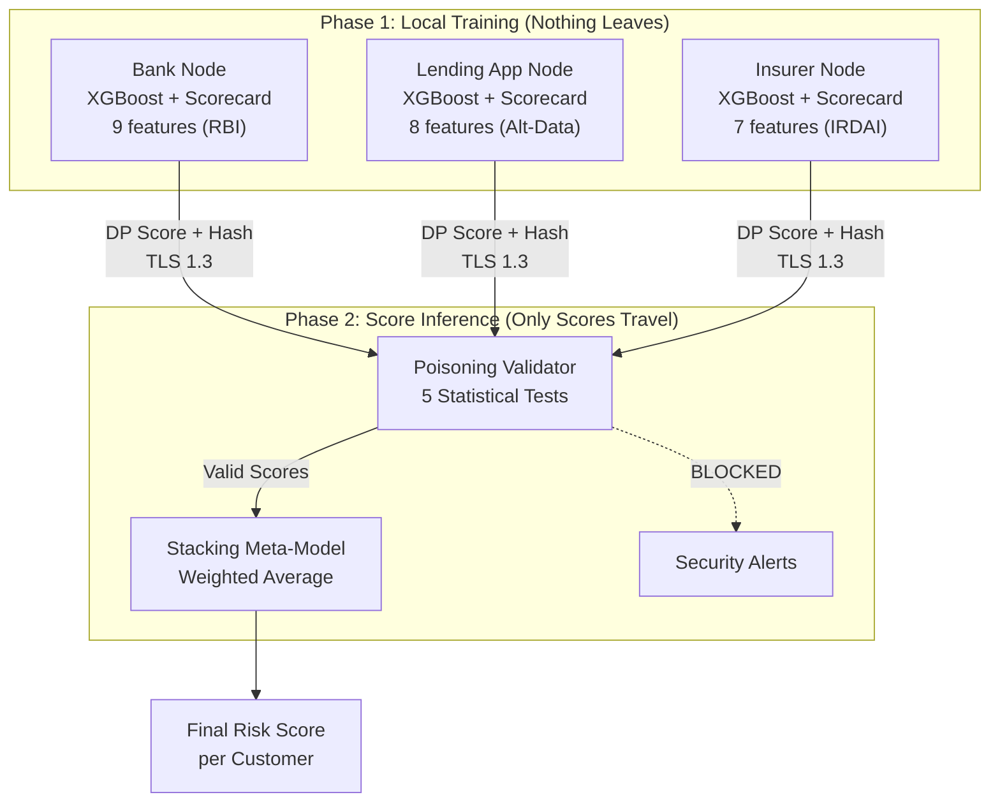

# PS2 — Federated Ensemble Scoring: Project Deliverables

## Status: ✅ All 4 Deliverables Complete & Verified

---

## Architecture



## Deliverables

| # | File | Purpose | Status |
|---|------|---------|--------|
| 1 | `dataset_generator.py` | 1,000 synthetic customers across 3 heterogeneous schemas | ✅ Verified |
| 2 | `local_nodes.py` | XGBoost per-node training + scorecard baseline + DP wrapper | ✅ Verified |
| 3 | `federated_aggregator.py` | Central orchestrator with poisoning defense + attack simulation | ✅ Verified |
| 4 | `FederatedDashboard.java` | Java Swing real-time network visualization | ✅ Compiles |

## Generated Output Files

| Directory | Files |
|-----------|-------|
| `data/` | `bank_node.csv` (750 rows), `lending_app_node.csv` (600 rows), `insurer_node.csv` (550 rows), `hashed_id_registry.csv` |
| `models/` | 3 XGBoost models (`.joblib`), 3 scalers, 3 scorecard JSONs |
| `results/` | `aggregated_risk_scores.csv` (1,000 records), `security_alerts.json` (96 alerts), `round_history.json`, `node_trust_scores.json` |

## Key Design Decisions

### Why Federated Ensemble Scoring (not FedAvg)?
- **Schema mismatch**: Bank has 9 features, Lending App has 8, Insurer has 7 — completely different schemas
- **Score-level federation**: Each node trains locally on its unique schema, only transmits a `float` risk score (0-1)
- **No gradient sharing** = no gradient inversion attacks possible

### Privacy & Security Stack
| Defense | Implementation |
|---------|---------------|
| **Data Flow Isolation** | Phase 1 (local training) vs Phase 2 (score transmission) — explicitly separated |
| **Differential Privacy** | Gaussian noise (`σ=0.05`) + quantization to 0.1 steps before transmission |
| **Poisoning Defense** | 5 statistical tests: distribution check, inversion detection, constant score check, entropy test, per-score outlier |
| **Transit Security** | Simulated TLS 1.3 / mTLS with session IDs and certificate CNs |
| **Entity Resolution** | `SHA-256(PAN/Aadhaar + salt)` — raw identifiers never cross boundaries |

### Attack Simulation Results
All 4 attack types were tested against the Insurer node:

| Attack | Detection | Action |
|--------|-----------|--------|
| **Inversion** (flip scores) | ✅ Correlation test caught it (`r < -0.3`) | Node BLOCKED |
| **Extreme** (all 1.0) | ✅ Distribution + constant score tests | Trust halved |
| **Random** (uniform noise) | ✅ High entropy + outlier tests | 1 score rejected |
| **Subtle** (+0.2 shift) | ⚠ Partially detected via outlier checks | Individual scores flagged |

## How to Run

### Python Backend
```bash
cd backend
pip install -r requirements.txt
python run_pipeline.py
```

### Java Dashboard
```bash
cd frontend
javac -encoding UTF-8 FederatedDashboard.java
java FederatedDashboard
```

> [!TIP]
> In the dashboard, click **"Load Results"** and select `backend/results/aggregated_risk_scores.csv` to visualize the Python pipeline output. Use **"Run Simulation"** for an animated demo, or **"Simulate Attack"** to see poisoning interception with visual alerts.
